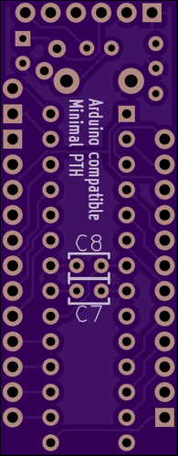

Arduino_Minimal_PTH
===================

Crazy stupid experiment to see how small you can make an Arduino-compatible
board using through-hole parts.

The design is based on the 
[Arduino Pro Mini](http://arduino.cc/en/Main/arduinoBoardProMini), and it tries
to follow that board's I/O conventions. Everything that can be considered 
optional has been eliminated.

Made with [KiCad](http://www.kicad-pcb.org/), which is [free and open source software](http://en.wikipedia.org/wiki/Free_and_open-source_software).
No raptors were touched in the making of this board.

 

No, I haven't built it (yet?).
